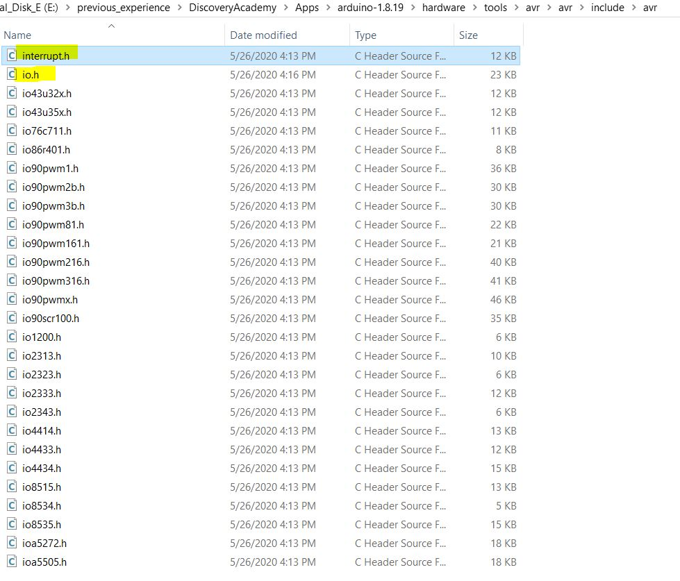

### Serial Peripheral Interface( SPI )

#### The Include Chain in arduino IDE

When you write Arduino code, here's the automatic include chain:

```cpp
Every .ino sketch automatically has this line added by the IDE:
#include <Arduino.h>
```

```
Your Arduino sketch (.ino)
    ↓
Arduino.h (automatically included)
    ↓
avr/io.h
    ↓
avr/iom328p.h (for Uno) or avr/iom2560.h (for Mega)
```

When you use ISR(), the avr/interrupt.h (also auto-included) provides the macro

<p align="center">
  
</p>

##### How Does It Know Which Chip?

When you select **Tools** → **Board** → Arduino Uno in the IDE, it sets compiler flags:

```bash
-mmcu=atmega328p
```

This defines the **AVR_ATmega328P** preprocessor macro, which tells avr/io.h to include iom328p.h.

file path `iom328p.h`
E:\previous_experience\DiscoveryAcademy\Apps\arduino-1.8.19\hardware\tools\avr\avr\include\avr\iom328p.h
E:\arduino-1.8.19\hardware\tools\avr\avr\include\avr\iom328p.h

file path `SPI.cpp/.h`
arduino-1.8.19\hardware\arduino\avr\libraries\SPI\src

file path `Arduino.h`
E:\previous_experience\DiscoveryAcademy\Apps\arduino-1.8.19\hardware\arduino\avr\cores\arduino
