### Universal Asynchronous Receiver-Transmitter (UART)

In this article, you will learn the basics of (UART),
a `serial` communication protocol that can be used to `send` `data` between an `Arduino board` and `other devices`.

UART is one of the most used device-to-device (serial) communication protocols.
It allows an `asynchronous` serial communication in which the `data format` and `transmission speed` are `configurable`.

it's still widely used for `lower-speed` and `lower-throughput` applications because it is very `simple`, `low-cost` and `easy to implement`.

`Communication via UART is enabled by the **Serial** class`, which has a number of methods available, including reading & writing data.

#### Serial Class

With the `Serial class`, you can `send / receive` `data` `to` and `from` your `computer over USB`, **or** `to` a `device` connected `via` the Arduino's `RX/TX pins`.

- `When` `sending data over USB`, we use `Serial`.
- `When` sending `data over RX/TX pins`, we use `Serial1`.
- All Arduino boards have at least one serial port (also known as a UART or USART), and some have severa
  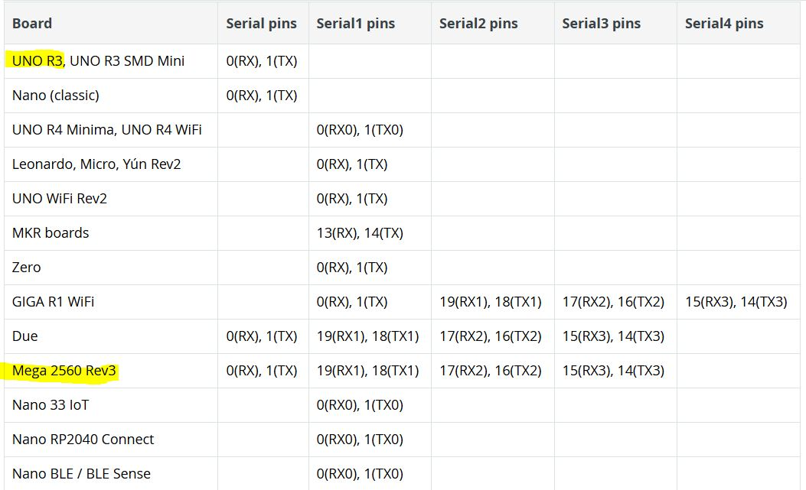

###### The `Serial class` have several methods with some of the essentials being:

- `begin()` - begins serial communication, with a specified baud rate (many examples use either 9600 or 115200).
- `print()` - prints the content to the Serial Monitor.
- `println()` - prints the content to the Serial Monitor, and adds a new line.
- `available()` - checks if serial data is available (if you send a command from the Serial Monitor).
- `read()` - reads data from the serial port.
- `write()` - writes data to the serial port.

For example, to initialize serial communication on both serial ports, we would write it as:

```arduino
Serial.begin(9600); //init communication over USB
Serial1.begin(9600); //communication over RX/TX pins
```

#### How UART Works

- UART operates by transmitting data as a series of bits, including a `start bit`, `data bits`, an `optional parity bit`, and `stop bit(s)`.
- operates asynchronous (doesn't rely on a shared clock signal), Instead uses **predefined baud rates** to `determine` the `timing` of `data bits`.
- Every bit is defined with a static signal level
  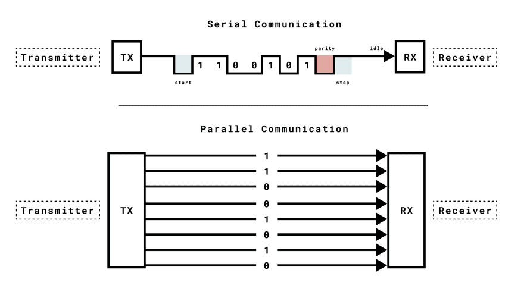

`Note: `you need to connect a common ground between the devices to define the high and low signals for UART communication. Without a common ground, devices may not be able to correctly interpret transmitted data.

#### Timing and Synchronization

Timing and synchronization are crucial aspects of UART communication. Unlike synchronous serial communication protocols such as SPI and I2C, UART uses predefined baud rates to determine the timing of data bits.

##### Baud Rate

- represents the number of bits transmitted in one second.
- In UART, both the transmitting and receiving devices must agree on the same baud rate to ensure successful communication.
- A higher baud rate allows for faster data transmission, but it also demands a more precise timing synchronization between the sender and receiver.

```ARDUINO
Serial.begin(9600);
```

#### UART Flow Control Introduction

UART Flow Control is a method for slow and fast devices to communicate with each other over UART without the risk of losing data.

#### UART Messages

- `Each` `data frame` is `encapsulated by` `start` and `stop` bits.
- These bits serve a vital role in establishing the boundaries of data transmission and ensuring synchronization between the sender and receiver.

  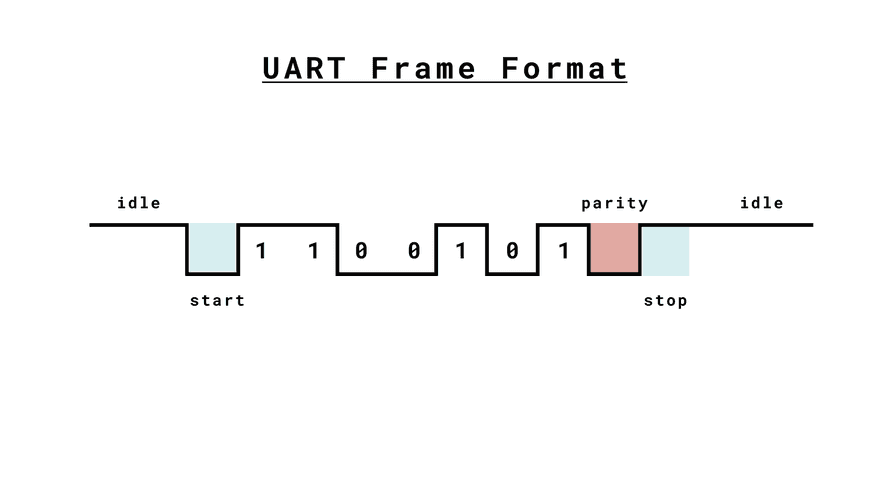

#### Serial USB Examples

==Basic Print Example==

```arduino
void setup(){
  Serial.begin(9600); //initialize serial communication at a 9600 baud rate
}

void loop(){
  // note: each charachter 8bit sends in a seperate frame
  Serial.println("Hello world!"); // 14 frame
  delay(1000);
}
```

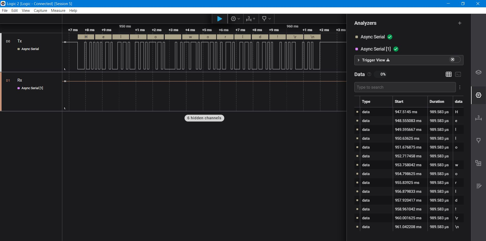

<p align="center">
  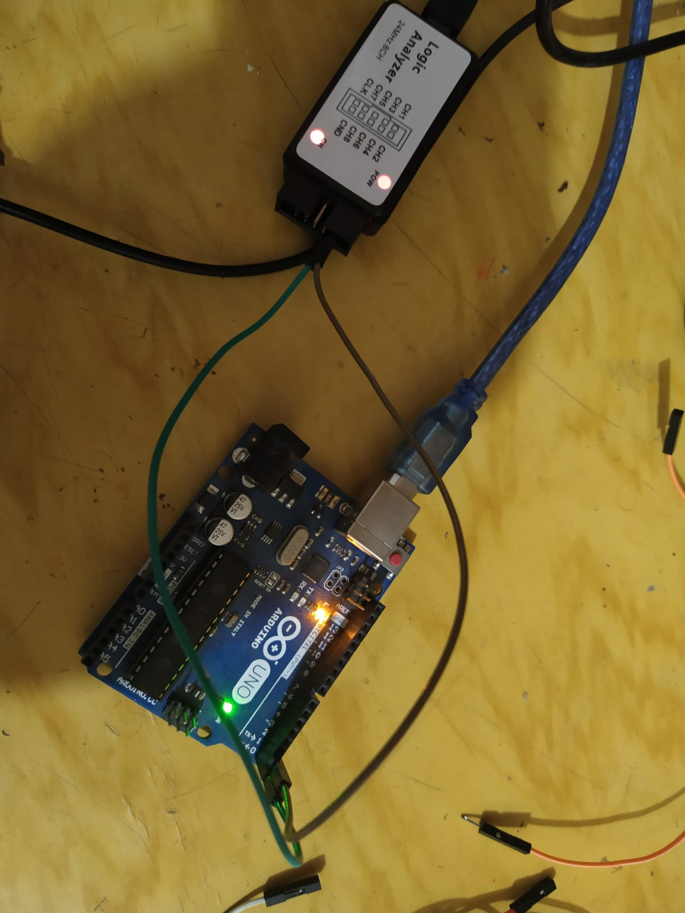
  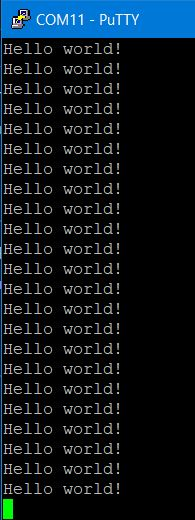
</p>

- **Note**: Arduino UNO R3 schematic (Tx, Rx) of Target MCU(ATMEGA328P)
connected with (TX, RX) pins of MCU for Virtual Port(ATMEGA16U2-MU(R)
)
  <p align="center">
  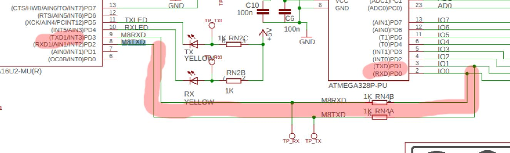
</p>

==Read==

To send data from a computer to an arduino, we can make use of the Serial.available() and Serial.read() functions

```c
int incomingByte = 0; // for incoming serial data

void setup() {
  Serial.begin(9600); //initialize serial communication at a 9600 baud rate
}

void loop() {
  // send data only when you receive data:
  if (Serial.available() > 0) {
    // read the incoming byte:
    incomingByte = Serial.read();

    // say what you got:
    Serial.print("I received: ");
    Serial.println(incomingByte, DEC);
  }
}
```

<p align="center">
  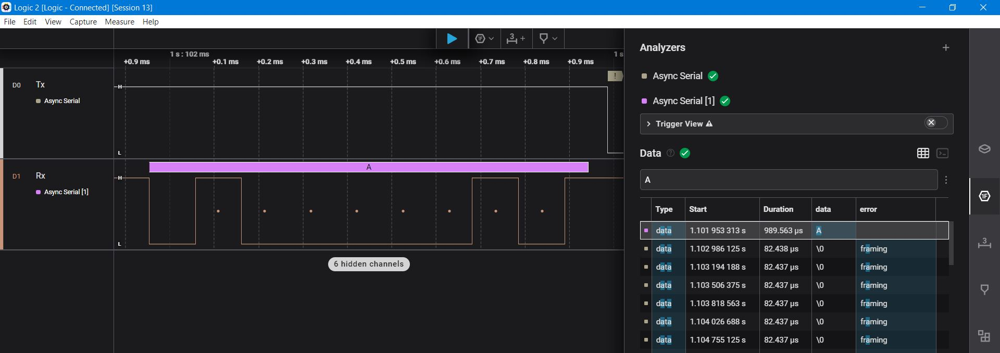
</p>
<p align="center">
  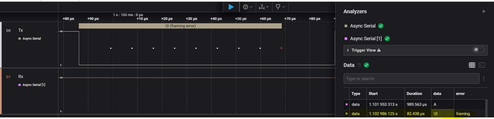
</p>
<p align="center">
  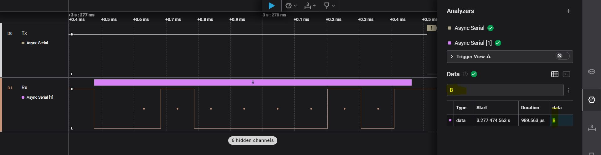
</p>

#### RX/TX Pin Examples(Polling or waiting way)

<p align="center">
  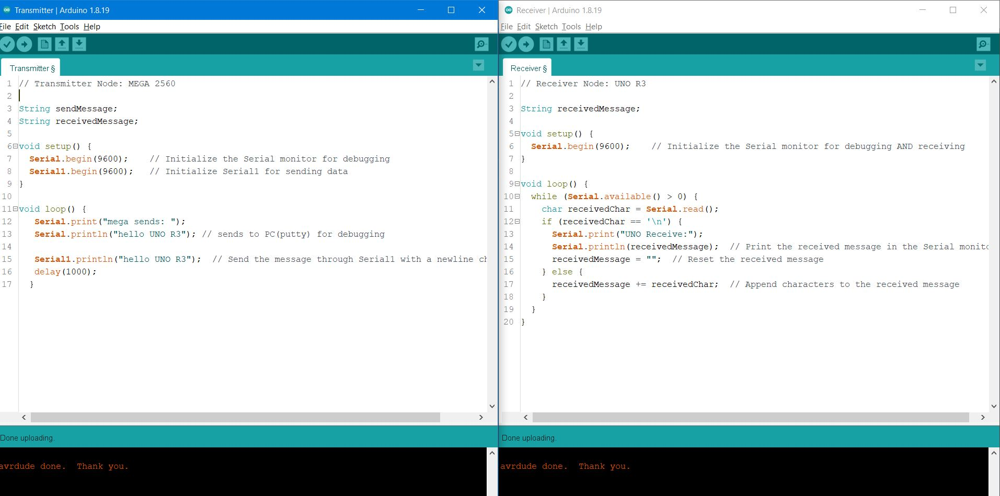
</p>

<p align="center">
  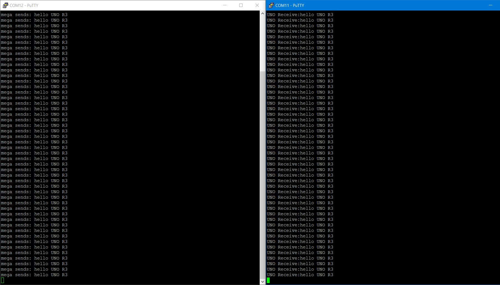
</p>

<p align="center">
  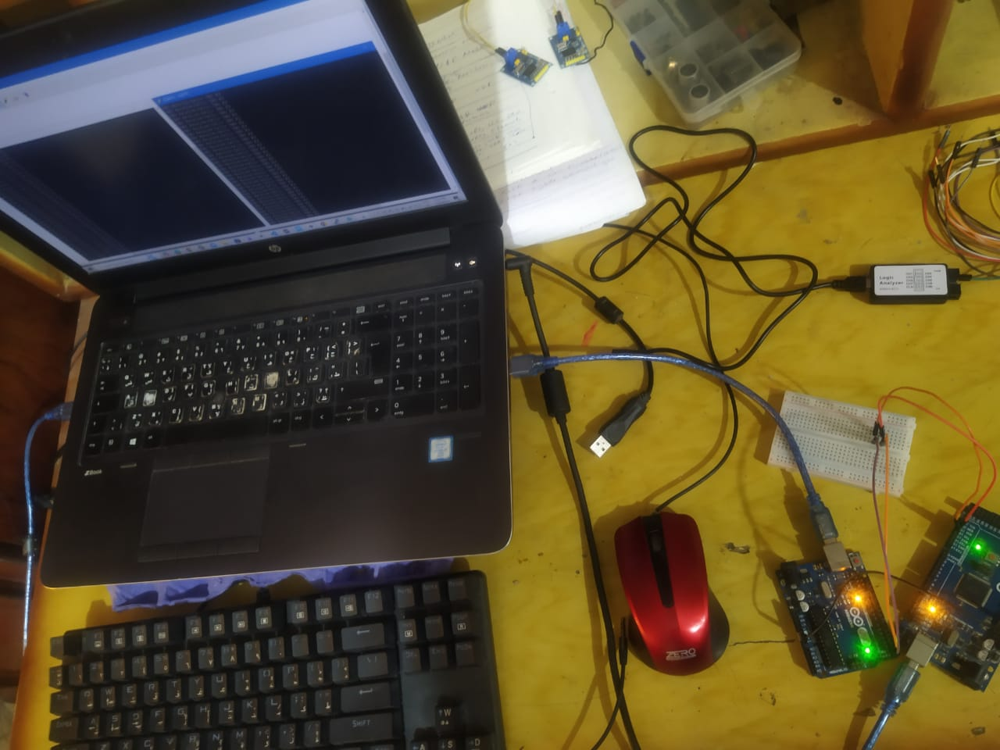
</p>
// SEnder 2
<p align="center">
  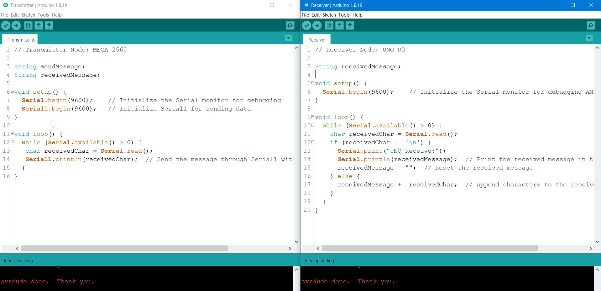
</p>

<p align="center">
  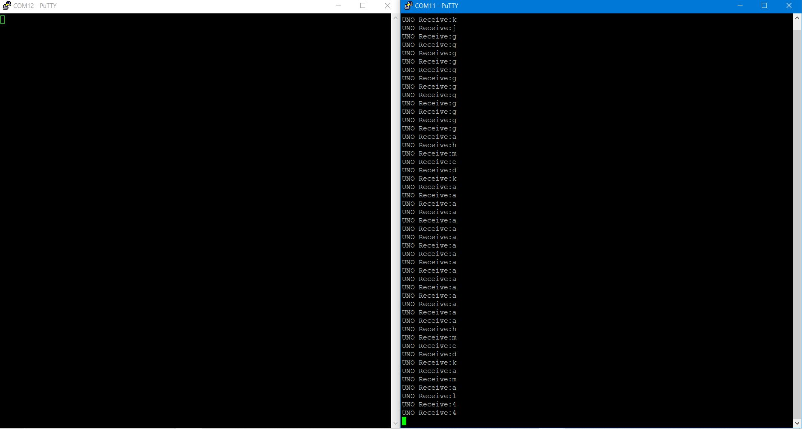
</p>

#### Null character

The null character (␀) is a control character with the value zero. It is present in many character sets, including ASCII and its extensions, Unicode, EBCDIC, and others. In some cases, it is referred to as the NUL character.

Here are some key details:
In ASCII and Unicode, the null character is defined to be U+0000, meaning it is represented in Unicode as the number 0.
The null character is used in C and C++ as a string terminator, marking the end of a string of characters. This allows the program to know when it has reached the end of the string.
The null character does not have a visual representation, meaning it's invisible when it's in a string of text.
In some contexts, it is used for padding where a fixed size data buffer is required.
Null characters can sometimes cause issues, especially when dealing with text, because many programs will stop reading a string of text when they encounter a null character, assuming that it's the end of the string.
In network communications, the null character is often used to signal the end of a message.

[NULL](https://www.ascii-code.com/character/%E2%90%80#:~:text=In%20ASCII%20and%20Unicode%2C%20the,Unicode%20as%20the%20number%200.)
